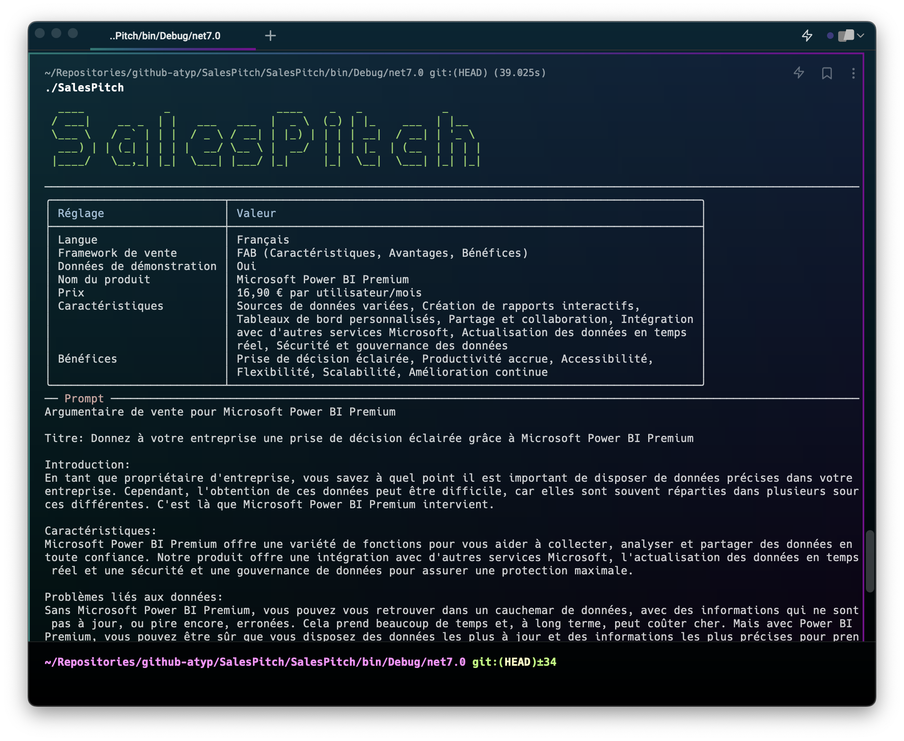

# SalesPitch [](https://stars.medv.io/Atypical-Consulting/SalesPitch)

SalesPitch est une application de génération de pitch de vente utilisant OpenAI GPT-3. Créez des pitchs de vente percutants pour vos produits en quelques étapes simples.



## Fonctionnalités

* Interagit avec OpenAI GPT-3.5 pour générer des pitchs de vente
* Prend en charge plusieurs langues (Français et Anglais)
* Comprend plusieurs cadres de pitch de vente
  * AIDA (Attention, Interest, Desire, Action) 
  * PAS (Problem-Agitate-Solve)
  * USP (Unique Selling Proposition)
  * Features-Benefits
  * Storytelling
  * WIIFM (What’s In It For Me)
  * Youtility
  * FAB (Features, Advantages, Benefits)
  * HHE (Headline, Hook, Empathy)
  * SUSPENSE (Surprise, Uniqueness, Specifics, Promise, Excitement, Newness, Story)
* Interface utilisateur conviviale avec Spectre.Console
* Possibilité d'utiliser des données de démonstration

## Installation

Assurez-vous d'avoir installé .NET 6.0 ou une version ultérieure sur votre machine.

Clonez ce dépôt et naviguez jusqu'au dossier source :

```sh
git clone https://github.com/user/SalesPitch.git
cd SalesPitch
```

Installez les dépendances et construisez le projet :

```sh
dotnet restore
dotnet build --configuration Release
```

## Configuration

1. Obtenez une clé API auprès d'OpenAI (https://beta.openai.com/signup/)
2. Créez un fichier appsettings.json à la racine du projet avec la clé API :

```json
{
  "OpenAIServiceOptions": {
    "ApiKey": "<your_openai_api_key>",
    "Organization": "<your_organization_id>"
  }
}
```

## Utilisation

Exécutez l'application en utilisant la commande suivante à la racine du projet :

```sh
dotnet run --configuration Release --project src/SalesPitch
```

L'application vous guidera à travers plusieurs étapes pour générer un pitch de vente pour votre produit. Vous pouvez également utiliser les données de démonstration pour voir comment l'application fonctionne.

## Contribution

Si vous souhaitez contribuer à ce projet, veuillez soumettre une pull request ou ouvrir une issue dans le dépôt GitHub.

## Licence

Ce projet est sous licence MIT. Voir le fichier [LICENSE](LICENSE) pour plus de détails.

## Remerciements

Cette application a été inspirée l'article suivant : [Write A Great Chat GPT Sales Pitch in 5 Steps](https://txtly.ai/write-a-chat-gpt-sales-pitch/)

* [OpenAI](https://openai.com/)
* [Spectre.Console](https://spectreconsole.net/)
* [Betalgo.OpenAI.GPT3](https://github.com/betalgo/openai)